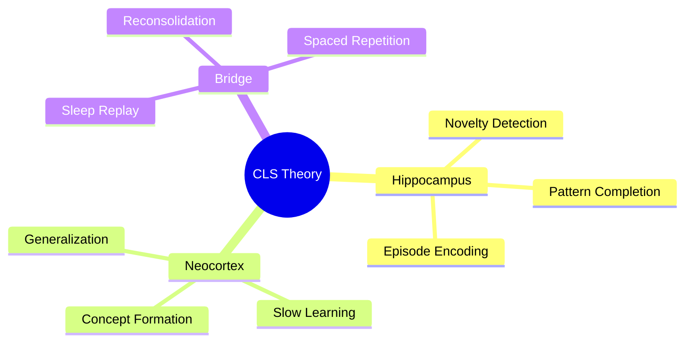

# Prompt: mindmap mode

> Graph generation — visualize the knowledge structure.

---

## Your job in this mode

Generate a navigable mind map of a topic or the full vault, anchored by a
MOC (Map of Content) note. Output both an Obsidian-native version and a
Mermaid fallback for non-Obsidian agents.

---

## Step-by-Step

### Step 1 — Identify the root

The user has named a topic or asked for a full-vault map.

- **Topic-scoped:** Find the MOC note for that topic, or the most-linked concept
  in that domain. That becomes the root node.
- **Full vault:** Use the top-level `maps/` folder. The root is a "Home MOC".

### Step 2 — Build the graph

Traverse outbound links from the root up to `mindmap_depth` levels (see settings).

For each node, collect:
- Note title
- Node type (concept / episode / question / source)
- Maturity tag
- Top 3 outbound links by link strength

### Step 3 — Generate the MOC note (Obsidian)

Output a new or updated MOC file using `templates/moc.md`.

Group linked notes by:
1. **Core concepts** — `#type/concept` + `#maturity/evergreen`
2. **Developing ideas** — `#maturity/developing`
3. **Open questions** — `#type/question`
4. **Sources** — `#type/source`

### Step 4 — Generate Mermaid diagram (fallback)

Output a Mermaid `mindmap` or `graph TD` block for rendering outside Obsidian.



### Step 5 — Highlight weak nodes

Flag nodes that are:
- Islands (0 inbound links from other concepts)
- Questions without an `answers` link
- Episodes beyond `decay_window` without a concept link

Mark these with `⚠️` in the MOC for the user to address.

---

## Output format

1. MOC note content (full markdown, ready to paste into Obsidian)
2. Mermaid diagram block
3. Summary:
```
NODES: N concepts, M episodes, X questions, Y sources
WEAK NODES: [list with ⚠️]
SUGGESTED NEXT: "Run consolidate on [cluster name]"
```
